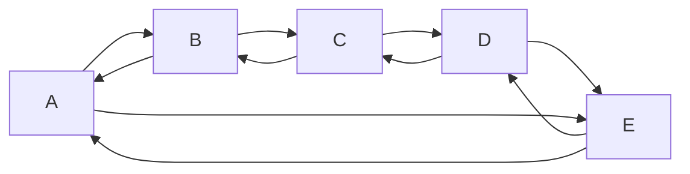

# 一.切片

切片我在python中接触过，相当的方便

* 切片的英文名称slice
* 切片:具有可变长度相同类型元素序列.
* 由于长度是`可变`,可以解决数组长度在数据个数不确定情况下浪费内存的问题.
* 切片和数组声明时语法最主要的区别就是`长度`

```go
	var slice []type   //切片  切片不需要说明长度。采用该声明方式且未初始化的切片为空切片。该切片默认为nil，长度为0
	var array [3]type //数组
```

* 切片只声明时为`nil`,没有开辟内存空间,不能直接操作切片,需要`先初始化`
* 注意:切片只能和nil进行判断是否相等

```go
	var slice []string  //切片
	fmt.Println(slice==nil)//输出:true
	fmt.Printf("%p",slice)//输出:0x0
```
使用make()函数来创建切片,但是不是nil,切片已经申请内存空间,当第三个参数容量省略时,默认与长度相同
切片的容量是成倍增加的，当增加到1024时会按照一一定百分比增加

    var slice []type = make([]type,len,cap)

    slice1:= make([]type ,len)
# 二.定义切片

* 通过直接指定初始值定初始化一个切片变量

```go
	names := []string{"algorithm", "算法"}
	fmt.Println(names)
```

* 定义完切片后就可以通过`切片对象[脚标]`取出或修改切片中元素内容.语法和数组相同

# 三.切片是引用类型

* 引用类型在变量之间赋值时传递的是地址.引用类型变量就是这个类型的指针.切片就是引用类型
* 值类型在变量之间赋值时传递的是值的副本
* 修改切片数值，当多个切片共享相同的底层数组时，对每个元素所做的更改将在数组中反映出来
* 切片没有自己的任何数据,它只是底层数组的一个引用
- 对切片所做的任何修改都将反映在底层数组中
- 数组是值类型，而切片是引用类型

```go
	names := []string{"algorithm", "算法"}
	names1 := names
	names1[0] = "法"
	fmt.Println(names, names1)//输出:[张 佳明哥] [张 佳明哥]
	fmt.Printf("%p %p",names,names1)//地址相同
```

# 四.切片的长度与容量
- 切片的容量是从创建切片的索引开始的底层数组中元素的数量
- 切片可以通过len()方法获取长度，可以通过cap()方法获取容量

# 五.append
- 可以向切片中添加一个或多个值，添加后必须s使用切片接收append()函数的返回值

- 如果添加一次添加多个值,且添加后的长度大于扩容一次的大小，容量和长度相等，等到下次添加内容的如果b不超出扩容大小，在现在的基础翻倍

- 也可以把一个切片内容添加到另一个切片里


# 六.通过数组产生切片


* 定义数组后,取出数组中一个片段,这个片段就是切片类型

```go
	names := [3]string{"老张", "佳明哥", "smallming"}
	s := names[0:2]     //包前不包后
	fmt.Printf("%T", s) //输出:[]string
	fmt.Println(s)      //输出:[老张 佳明哥]
```

* 切片是指针,指向数组元素地址,修改切片的内容,`数组的内容会跟随变化`

```go
	names := [3]string{"algo", "rithem", "math"}
	s := names[0:2] //包前不包后
	fmt.Printf("%p %p",s,&names[0])//输出的地址是相同的
	s[0] = "Go语言"
	fmt.Println(s)     //输出:[Go语言 佳明哥]
	fmt.Println(names) //输出:[Go语言 佳明哥 smallming]
```

* 当切片内容在增加时
  * 如果增加后切片的长度没有超出数组,修改切片也是在修改数组
  * 如果增加后切片的长度超出数组,会重新开辟一块空间放切片的内容
  * 通过下面代码也正面了切片中内容存在一块连续空间(和数组一样)

```go
	names := [3]string{"algo", "rithem", "math"}
	s := names[0:2] //包前不包后
	fmt.Printf("%p %p\n",s,&names[0])
	s[0] = "Go语言"
	s=append(s,"yep")
	fmt.Println(s)     //输出:[Go语言 佳明哥 区块链]
	fmt.Println(names) //输出:[Go语言 佳明哥 区块链]
	fmt.Printf("%p %p\n",s,&names[0])//地址相同

	s=append(s,"out of range")
	fmt.Println(s)     //输出:[Go语言 佳明哥 区块链 超出了数组长度]
	fmt.Println(names) //输出:[Go语言 佳明哥 区块链]
	fmt.Printf("%p %p\n",s,&names[0])//切片地址改变
```

# 七.删除实现

## 1.子切片删除
* Go语言标准库中没有提供删除的函数
* 切片也可以取其中的一段形成子切片,利用这个特性可以实现删除效果,本质就是删除底层数组的一部分

```go
	num := []int {0,1,2,3,4,5,6}
	//要删除脚标为n的元素
	n:= 2
	num1 :=num[0:n]
	num1= append(num1,num[n+1:]...)
	fmt.Println(num1)
```

## 使用copy完成删除元素
```
s := []int{1, 2, 3, 4, 5, 6, 7}
	n := 2 //要删除元素的索引
	newSlice := make([]int, n)
	copy(newSlice, s[0:n])
	newSlice = append(newSlice, s[n+1:]...)
	fmt.Println(s)        //原切片不变
	fmt.Println(newSlice) //删除指定元素后的切片
```


# 八.copy函数

- 通过copy函数可以把一个切片内容复制到另一个切片中
- func copy(dst, src []Type) int
`拷贝时严格按照脚标进行拷贝.且不会对目标切片进行扩容` ,也就是说会覆盖对应的值
- 把短切片拷贝到长切片中
- 把长切片拷贝到短切片中
- 把切片片段拷贝到切片中


# 一.操作List

* 直接使用container/list包下的New()新建一个空的List

```go
	mylist := list.New()
	fmt.Println(mylist)       //输出list中内容
	fmt.Println(mylist.Len()) //查看链表中元素的个数
	fmt.Printf("%p", mylist)  //输出地址
```

* Go语言标准库中提供了很多向`双向链表`中添加元素的函数

```go
	//添加到最后,List["a"]
	mylist.PushBack("a")
    //添加到最前面,List["b","a"]
	mylist.PushFront("b") 
	//向第一个元素后面添加元素,List["b","c","a"]
	mylist.InsertAfter("c", mylist.Front()) 
	//向最后一个元素前面添加元素,List["b","c","d","a"]
	mylist.InsertBefore("d", mylist.Back()) 
```

* 取出链表中的元素

```go
	fmt.Println(mylist.Back().Value)  //最后一个元素的值
	fmt.Println(mylist.Front().Value) //第一个元素的值

	//只能从头向后找,或从后往前找,获取元素内容
	n := 5
	var curr *list.Element
	if n > 0 && n <= mylist.Len() {
		if n == 1 {
			curr = mylist.Front()
		} else if n == mylist.Len() {
			curr = mylist.Back()
		} else {
			curr = mylist.Front()
			for i := 1; i < n; i++ {
				curr = curr.Next()
			}
		}
	} else {
		fmt.Println("n的数值不对")
	}
	//遍历所有值
	for e := mylist.Front(); e != nil; e = e.Next() {
		fmt.Println(e.Value)
	}
```

* 移动元素的顺序

```go
	mylist.MoveToBack(mylist.Front()) //把第一个移动到后面
	mylist.MoveToFront(mylist.Back()) //把最后一个移动到前面
	mylist.MoveAfter(mylist.Front(),mylist.Back())//把第一个参数元素,移动到第二个参数元素后面
	mylist.MoveBefore(mylist.Front(),mylist.Back())//把第一个参数元素,移动到第二个参数元素前面
```

* 删除元素

```go
mylist.Remove(mylist.Front())
```

# 一. map

* map以`散列表`方式存储键值对集合

* map中每个元素都是`键值对`

```
map[key] Value    写类型
```

* key是操作map的`唯一标准`.可以通过key对map中元素进行`增加/删除/修改/查看`
* key是`唯一`的,添加重复的key会覆盖之前的元素.
* map是值类型,`只声明时为空指针(nil)`

```go
	var m map[string]int
	fmt.Println(m == nil) //输出:true
	fmt.Printf("%p", m)   //输出:0x0
```

* map读写数据时并不是`并发安全`的,可以结合RWMutex保证并发安全(RWMutex在后面讲解),java提供concurrenthashmap解决方案

# 二.实例化map的几种方式

* 使用`make函数`实例化一个没有初始值的map

```go
	m:= make(map[string]string)
	fmt.Println(m==nil)//输出:false
	fmt.Printf("%p", m)//输出:内存地址
```

* 可以在声明map时直接给map赋初始值.注意初始值在一行和在多行写时的语法区别
  * map中元素键值对语法满足: key:value
  * key和value的类型必须和map[key]value类型严格对应

```go
	m := map[string]string{"name": "smallming", "address": "北京海淀"}
	m1 := map[string]string{
		"name":     "smallming",
		"addresss": "北京海淀",
	}
	fmt.Println(m, m1)
```

# 三.操作map中的元素

* 使用key判断,如果key不存在向map中新增数据,如果key存在会覆盖map中元素

```go
	m := make(map[string]int)
	m["money"] = 5
	fmt.Println(m) //输出:map[money:5]
	m["money"] = 6
	fmt.Println(m) //map[money:6]
```

* Go语言标准库中提供了对map元素删除的函数,使用`顶层delete()`即可完成删除
  * 如果key`存在执行`删除元素
  * 如果`key不存在,map中内容不变`,也不会有错误

```go
	m := make(map[string]int)
	m["money"] = 5
	delete(m, "没有的key")
	fmt.Println(m) //输出:map[money:5]
	delete(m, "money")
	fmt.Println(m) //输出:map[]
```

* 获取map中指定key对应的值
  * 使用:map变量[key]获取key对应的值
  * 如果`key不存在返回map[key]Value中Value类型的默认值`.例如:Value是string类型就返回`""`
  * 返回值可以是一个,也可以是两个.
    * 一个表示key对应的值
    * 两个分别表示:key对应的值和这个key是否存在

```go
	m := map[string]string{"name": "smallming", "address": "北京海淀"}
	fmt.Println(m["name"]) //输出:smallming
	fmt.Println(m["age"])  //输出:空字符串
	value, ok := m["age"]
	fmt.Println(value, ok) //输出:空字符串 false
```

* 如果希望把map中所有元素都`遍历`,可以使用`for结合range`实现

```go
	m := map[string]string{"name": "smallming", "address": "北京海淀"}
	//range遍历map时返回值分别表示key和value
	for key, value := range m {
		fmt.Println(key, value)
	}
```

# 一.双向循环链表

* 循环链表特点是没有节点的指针域为`nil`,通过`任何一个元素`都可以找到`其他元素`
* 环形链表结构如下



* 双向循环链表和双向链表区别

  * 双向循环链表没有严格意义上的`头元素`和`尾元素`
  * 没有元素的前连接(link)和后连接(link)为`nil`
  * 一个长度为n的双向循环链表,通过某个元素向某个方向移动,在查找最多`n-1`次后一定会找到另一个元素

# 二.Go语言中的双向循环链表

* 在container/ring包下结构体Ring源码如下
  * 官方明确说明了Ring是循环链表的元素,又是环形链表.
  * 实际使用时Ring遍历就是环形链表第一个元素

结构体
```go
// A Ring is an element of a circular list, or ring.
// Rings do not have a beginning or end; a pointer to any ring element
// serves as reference to the entire ring. Empty rings are represented
// as nil Ring pointers. The zero value for a Ring is a one-element
// ring with a nil Value.
//
type Ring struct {
	next, prev *Ring
	Value      interface{} // for use by client; untouched by this library
}
```

* Go语言标准库中对container/ring包提供的API如下

```go
	type Ring
		//实例化长度为n的环形链表
		func New(n int) *Ring
		//长度
		func (r *Ring) Len() int
		//下一个元素
		func (r *Ring) Next() *Ring
		//上一个元素
		func (r *Ring) Prev() *Ring
		//移动n次,支持负数
		func (r *Ring) Move(n int) *Ring
		//合并s和r
		func (r *Ring) Link(s *Ring) *Ring
		//删除r后面n%r.Len()元素,删除多个,当前元素前面的不删除
		func (r *Ring) Unlink(n int) *Ring
		//循环遍历,i是当前元素的值
		func (r *Ring) Do(f func(interface{}))
```

# 三.代码演示

* 实例化、赋值、遍历

```go
	r := ring.New(3)
	for i := 0; i < r.Len(); i++ {
		r.Move(i).Value = i
	}
	r.Do(func(i interface{}) {
		fmt.Println(i)
	})
```

* 实例化后的r就是链表中`第一个创建的元素`.可以找到元素的`前后元素`

```go
	fmt.Println(r.Next().Value)//输出:1
	fmt.Println(r.Next().Next().Value)//输出:2
	fmt.Println(r.Next().Next().Next().Value)//输出:0
	fmt.Println(r.Move(-1).Value)//输出:2
	fmt.Println(r.Prev().Value)//输出:2
```

* 可以向环形链表添加或删除链表

```go
	s := ring.New(1)
	s.Value = 13
	//r是哪个元素,就把新的链表添加到哪个元素后面
	r.Link(s) //把元素link到指定位置
	r.Do(func(i interface{}) {
		fmt.Print(i, " ")
	})
	fmt.Println("")
	//从r元素向后,n/r.Len()个元素被删除,当前元素和前面的保留
	r.Unlink(1) //从链表上删除指定元素
	r.Do(func(i interface{}) {
		fmt.Print(i, " ")
	})
```

# 一.双向链表概述


* 双向链表结构中元素在内存中不是`紧邻空间`,而是每个元素中存放上一个元素和后一个元素的地址

  * 第一个元素称为头(head)元素,前连接(前置指针域)为nil
  * 最后一个元素称为尾(foot)元素,后连接(后置指针域)为nil

* 双向链表的优点:

  * 在执行新增元素或删除元素时效率高,获取任意一个元素,可以方便的在这个元素前后插入元素
  * 充分利用内存空间,实现内存灵活管理
  * 可实现`正序`和`逆序`遍历
  * `头元素`和`尾元素`新增或删除时效率较高

* 双向链表的缺点

  * 链表增加了元素的指针域,`空间开销比较大`
  * 遍历时跳跃性查找内容,大量数据遍历性能低

# 二. 双向链表容器List

* 在Go语言标准库的container/list 包提供了双向链表List
* List结构体定义如下
  * root表示`根元素`
  * len表示链表中有多少个元素

```Go
// List represents a doubly linked list.
// The zero value for List is an empty list ready to use.
type List struct {
	root Element // sentinel list element, only &root, root.prev, and root.next are used
	len  int     // current list length excluding (this) sentinel element
}
```

* 其中Element结构体定义如下
  * next表示下一个元素,使用Next()可以获取到
  * prev表示上一个元素,使用Prev()可以获取到
  * list表示元素属于哪个链表
  * Value表示元素的值,interface{}在Go语言中表示任意类型

```Go
  // Element is an element of a linked list.
  type Element struct {
  	// Next and previous pointers in the doubly-linked list of elements.
  	// To simplify the implementation, internally a list l is implemented
  	// as a ring, such that &l.root is both the next element of the last
  	// list element (l.Back()) and the previous element of the first list
  	// element (l.Front()).
  	next, prev *Element

  	// The list to which this element belongs.
  	list *List

  	// The value stored with this element.
  	Value interface{}
  }
```
