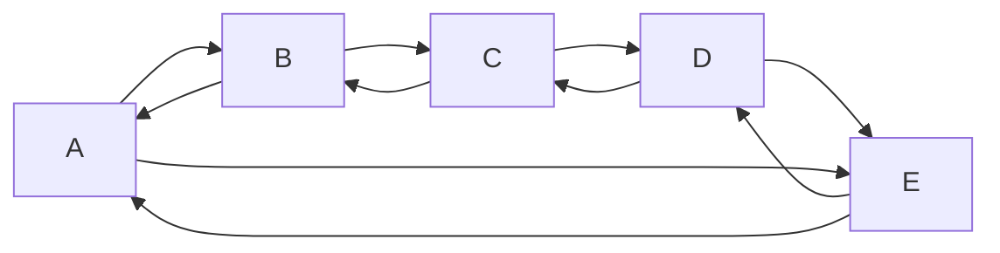

# 一.双向循环链表

* 循环链表特点是没有节点的指针域为`nil`,通过`任何一个元素`都可以找到`其他元素`
* 环形链表结构如下



* 双向循环链表和双向链表区别

  * 双向循环链表没有严格意义上的`头元素`和`尾元素`
  * 没有元素的前连接(link)和后连接(link)为`nil`
  * 一个长度为n的双向循环链表,通过某个元素向某个方向移动,在查找最多`n-1`次后一定会找到另一个元素

# 二.Go语言中的双向循环链表

* 在container/ring包下结构体Ring源码如下
  * 官方明确说明了Ring是循环链表的元素,又是环形链表.
  * 实际使用时Ring遍历就是环形链表第一个元素

结构体
```go
// A Ring is an element of a circular list, or ring.
// Rings do not have a beginning or end; a pointer to any ring element
// serves as reference to the entire ring. Empty rings are represented
// as nil Ring pointers. The zero value for a Ring is a one-element
// ring with a nil Value.
//
type Ring struct {
	next, prev *Ring
	Value      interface{} // for use by client; untouched by this library
}
```

* Go语言标准库中对container/ring包提供的API如下

```go
	type Ring
		//实例化长度为n的环形链表
		func New(n int) *Ring
		//长度
		func (r *Ring) Len() int
		//下一个元素
		func (r *Ring) Next() *Ring
		//上一个元素
		func (r *Ring) Prev() *Ring
		//移动n次,支持负数
		func (r *Ring) Move(n int) *Ring
		//合并s和r
		func (r *Ring) Link(s *Ring) *Ring
		//删除r后面n%r.Len()元素,删除多个,当前元素前面的不删除
		func (r *Ring) Unlink(n int) *Ring
		//循环遍历,i是当前元素的值
		func (r *Ring) Do(f func(interface{}))
```

# 三.代码演示

* 实例化、赋值、遍历

```go
	r := ring.New(3)
	for i := 0; i < r.Len(); i++ {
		r.Move(i).Value = i
	}
	r.Do(func(i interface{}) {
		fmt.Println(i)
	})
```

* 实例化后的r就是链表中`第一个创建的元素`.可以找到元素的`前后元素`

```go
	fmt.Println(r.Next().Value)//输出:1
	fmt.Println(r.Next().Next().Value)//输出:2
	fmt.Println(r.Next().Next().Next().Value)//输出:0
	fmt.Println(r.Move(-1).Value)//输出:2
	fmt.Println(r.Prev().Value)//输出:2
```

* 可以向环形链表添加或删除链表

```go
	s := ring.New(1)
	s.Value = 13
	//r是哪个元素,就把新的链表添加到哪个元素后面
	r.Link(s) //把元素link到指定位置
	r.Do(func(i interface{}) {
		fmt.Print(i, " ")
	})
	fmt.Println("")
	//从r元素向后,n/r.Len()个元素被删除,当前元素和前面的保留
	r.Unlink(1) //从链表上删除指定元素
	r.Do(func(i interface{}) {
		fmt.Print(i, " ")
	})
```